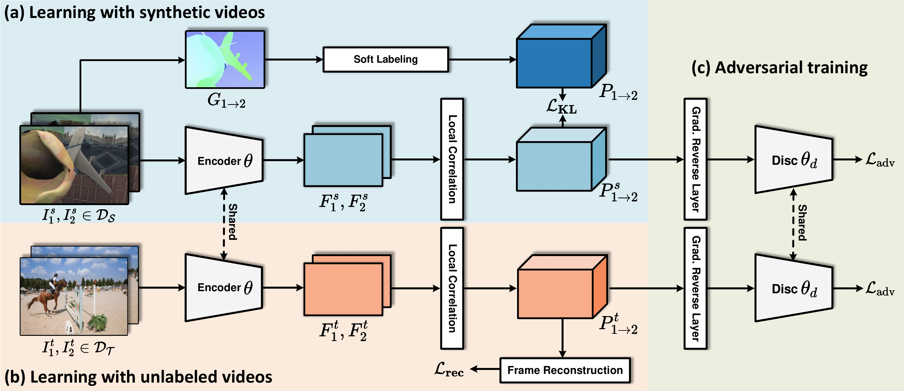

## [ICCV 2023] Learning Fine-Grained Features for Pixel-wise Video Correspondences

[](https://github.com/qianduoduolr/FGVC/blob/base/LICENSE)

[Rui Li](https://qianduoduolr.github.io/)<sup>1</sup>, Shenglong Zhou<sup>1</sup>, and [Dong Liu](https://faculty.ustc.edu.cn/dongeliu/en/index/85593/list/index.htm)<sup>1</sup>


<sup>1</sup>University of Science and Technology of China, Hefei, China

<!-- ##### [Paper](https://arxiv.org/pdf/) | [Video](https://www.youtube.com/)
 -->

#### [[Paper](https://arxiv.org/pdf/2308.03040.pdf)] /  [[Demo](https://youtu.be)] / [[Project page](https://qianduoduolr.github.io/)] / [[Poster](https://drive.google.com)] / [[Intro](https://youtu.be/)]

This is the official code for  "**Learning Fine-Grained Features for Pixel-wise Video Correspondences**". 

<p float="left">


<!--  -->


Without any fine-tuning, the proposed method can be directly applied to various correspondence-related tasks including long-term point tracking, video object segmentation, etc.


## :star: News
- *2023.07.14:*  Our paper "Learning Fine-Grained Features for Pixel-wise Video Correspondences" is accepted to ICCV 2023. The code for inference and training will be released as soon as possible.

- *2023.10.04:*  We have released the code and models of the paper "Learning Fine-Grained Features for Pixel-wise Video Correspondences".


## Overview
<!--  -->

<div  align="center">    
 
</div>
   Video analysis tasks rely heavily on identifying the pixels from different frames that correspond to the same visual target. To tackle this problem, recent studies have advocated feature learning methods that aim to learn distinctive representations to match the pixels, especially in a self-supervised fashion. Unfortunately, these methods have difficulties for tiny or even single-pixel visual targets. Pixel-wise video correspondences were traditionally related to optical flows, which however lead to deterministic correspondences and lack robustness on real-world videos. We address the problem of learning features for establishing pixel-wise correspondences. Motivated by optical flows as well as the self-supervised feature learning, we propose to use not only labeled synthetic videos but also unlabeled real-world videos for learning fine-grained representations in a holistic framework. We adopt an adversarial learning scheme to enhance the generalization ability of the learned features. Moreover, we design a coarse-to-fine framework to pursue high computational efficiency. Our experimental results on a series of correspondence-based tasks demonstrate that the proposed method outperforms state-of-the-art rivals in both accuracy and efficiency.


## Citation
If you find this repository useful for your research, please cite our paper:

```latex
@inproceedings{li2023learning,
  title={Learning Fine-Grained Features for Pixel-wise Video Correspondences},
  author={Li, Rui and Zhou, Shenglong and Liu, Dong},
  booktitle={ICCV},
  pages={9632--9641},
  year={2023}
}
```

Our other paper related to video correspondence learning ([Spa-then-Temp](https://github.com/qianduoduolr/Spa-then-Temp)):
```latex
@inproceedings{li2023spatial,
  title={Spatial-then-Temporal Self-Supervised Learning for Video Correspondence},
  author={Li, Rui and Liu, Dong},
  booktitle={CVPR},
  pages={2279--2288},
  year={2023}
}
```

## Prerequisites

* Python 3.8.8
* PyTorch 1.9.1
* mmcv-full == 1.5.2
* davis2017-evaluation


To get started, first please clone the repo
```
git clone https://github.com/qianduoduolr/FGVC
```
<!-- Then, please run the following commands:
```
conda create -n fgvc python=3.8.8
conda activate fgvc

pip install  torch==1.9.1+cu111 torchvision==0.10.1+cu111 torchaudio==0.9.1 -f https://download.pytorch.org/whl/torch_stable.html
pip install  mmcv-full==1.5.2 -f https://download.openmmlab.com/mmcv/dist/cu111/torch1.9.0/index.html
pip install -r requirements.txt
pip install future tensorboard

# setup for davis evaluation
git clone https://github.com/davisvideochallenge/davis2017-evaluation.git && cd davis2017-evaluation
python setup.py develop
```
 -->
 For convenience, we provide a [Dockerfile](docker/Dockerfile). Alternatively, you can install all required packages manually. Our code is based on [mmcv](https://github.com/open-mmlab/mmcv) framework and [Spa-then-Temp](https://github.com/qianduoduolr/Spa-then-Temp). You can refer to those repositories for more information.


## Evaluation
The evaluation is particularly conducted on pixel-wise correspondence-related tasks, i.e., point tracking, on TAP-Vid dataset.

We follow the prior studies to leverage label propagation for inference, which can be achieved by:
```shell
bash tools/dist_test.sh ${CONFIG}  ${GPUS}
```

Note you need download the pre-trained models with [this link](https://drive.google.com/file/d/1ZJHyWMOpWhfmX6vMX5Qkm_2qkqS0grNM/view?usp=drive_link). Then you need to modify the `checkpoint_path` in `CONFIG`. We give a inference cmd example:

```shell
# testing for point tracking on TAP-Vid-DAVIS
bash tools/dist_test.sh configs/eval/tapdavis_eval.py 4
```


## Tranining (to be updated)
We perform training on FlyingThings and YouTube-VOS:

```shell
bash tools/dist_train.sh configs/train/train.py 4
```

## License
This work is licensed under MIT license. See the [LICENSE](LICENSE) for details.

## Acknowledgement
The codebase is implemented based on the [MMCV](https://github.com/open-mmlab/mmcv), [tapnet](https://github.com/google-deepmind/tapnet), and [VFS](https://github.com/xvjiarui/VFS). Thanks for these excellent open source repositories.
